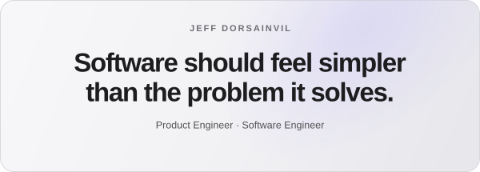
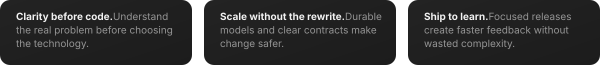
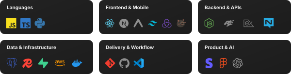
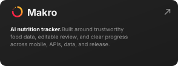
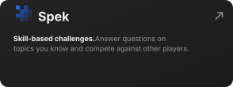
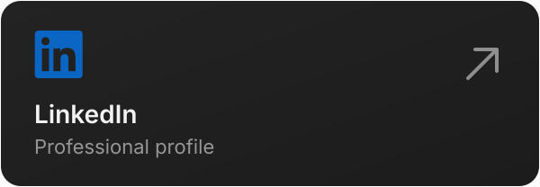
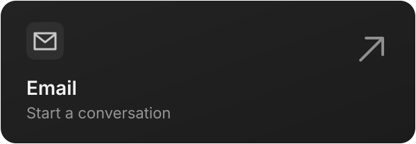

  

  <a href="#what-i-believe">Belief</a>&nbsp;&nbsp;·&nbsp;&nbsp;
  <a href="#zero-to-one">Products</a>&nbsp;&nbsp;·&nbsp;&nbsp;
  <a href="#connect">Connect</a>

 

WHY I BELIEVE THIS

<h3 align="center"><big>Every technical decision reaches the user.</big></h3>

  The details show how seriously you take their experience.

 

  

 

THE STACK

<h3 align="center"><big>Tools I work with.</big></h3>

  

 

ZERO TO ONE

<h3 align="center"><big>What I've been building.</big></h3>

  

 

CONNECT

<h3 align="center"><big>Let's build something people return to.</big></h3>

  &nbsp;&nbsp;&nbsp;&nbsp;
  

Open to <strong>Product Engineer</strong> and <strong>Full-Stack TypeScript Engineer</strong> opportunities.

